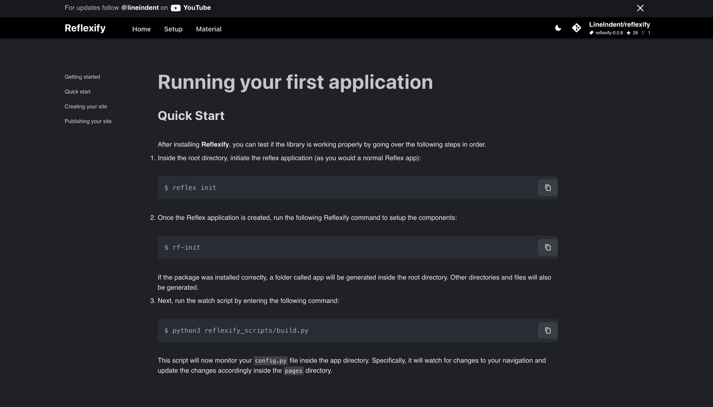

<h1 align="center" style="font-size: 5em; font-weight: 100;">reflexify.</h1>


<div align="center">
  <!-- <a href="https://github.com/LineIndent/fletxible/actions/workflows/build.yml">
    
  </a>  -->
  <!-- <a href="https://fletxible.readthedocs.io/en/latest/?badge=latest">
    
  </a> -->
  <!-- <a href="https://pypi.org/project/fletxible/">
    
  </a> -->
  
  <a href="https://pypi.org/project/reflexify/">
    
  </a>

  <a href="https://pypi.org/project/reflexify/">
    
  </a>
</div>

<br>

<p align="center">
Reflexify is a Python web boilerplate library designed to provide a solid foundation to rapidly build high quality web applications with Python and Reflex. The project comes pre-configured with a range of tools and features to make it easy for developers to get started building their applications, without the need to spend time setting up infrastructure or configuring tools.</p>

<!--  -->

## Installation

To use Reflexify, you need to have the following installed:

-   Latest version of Reflex
-   Python 3.7+

If you don't have Reflex installed, installing Reflexify automatically installs it for you. You can install Reflexify using the following command:
```py
$ pip install reflexify 
```


## Application Setup

After installing Reflexify, you can test if it's working properly by running the following commands:

Inside the root directory, initiate the reflex application:

```py
$ reflex init
```

Once the Reflex application is created, run the following Reflexify command to setup the components:

```py
$ rf-init
```

If the package was installed correctly, a folder called ```app``` will be generated inside the root directory. Other directories and files will also be generated.

Next, run the watch script by entering the following command:

```py
$ python3 reflexify_scripts/build.py
```

This script will now monitor your ```config.py``` file inside the ```app``` directory. Specifically, it will watch for changes to your navigation and update the changes accordingly. 

## 3. Quick Start

Open the  ```config.py``` file inside the ```app``` folder and configure the document as needed. Change the site name, repository link, as well as any theme-related settings. You can also add/remove the navigation section as needed.

When you're ready, open up a second terminal and move into the root directory of the project you are working on. Run the following command to run your application and view it (as you would normally a Reflex application)
```py
reflex run
```

If successful, the script should generate the files inside the ```pages``` folder that correspond to the ```config.py``` navigation map. 

If the setup has no error, you can start customizing your pages by adding in your personal layout directly within the generated pages inside the ```pages``` directory.

## 4. Configuration API

To see what goes inside the ```config.py``` file, you can visit the following [Reflexify-API](https://reflexify-api.vercel.app/) for more details.

## Contributing

Contributions are highly encouraged and welcomed.


## License

Reflexify is open-source and licensed under the [MIT License](LICENSE).


